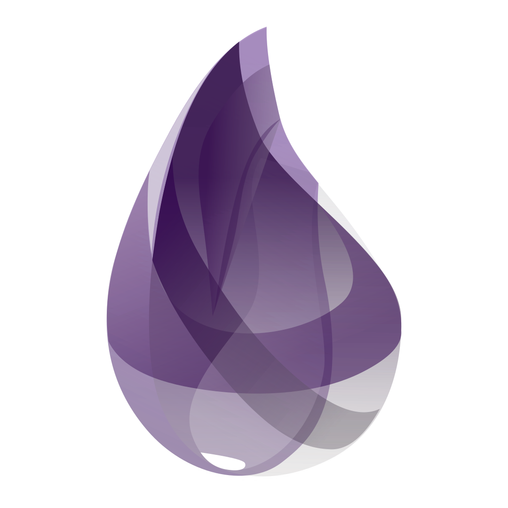

<h1 align="left" id="macropower-title">:wave: Hello there! I'm Maxim Iurev</h1>
<h3 align="left">Backend developer, before frontend developer</h3>

  <a href="https://github.com/StreetXHasu">
    

- :seedling: &nbsp;I’m currently learning **Go**
- :mailbox: &nbsp;Ask me anything on my **[issues page]**

 

<h2 align="left" id="favorite-tech">Favorite Tech</h2>

> Tools, languages, and other things that I like to work with.

<table>
  <tr>
    <td align="center" width="96">
      
       PHP&nbsp;v8+
    </td>
    <td align="center" width="96">
      
       JavaScript
    </td>
    <td align="center" width="96">
      
       TypeScript
    </td>
    <td align="center" width="96">
      
       Go
    </td>
        <td align="center" width="96">
      
       Elixir
    </td>
    <td align="center" width="96">
      
       React
    </td>
    <td align="center" width="96">
      
       Tailwind
    </td>
    <td align="center" width="96">
      
       Bootstrap
    </td>
    <td align="center" width="96">
      
       Sass
    </td>
  </tr>
  <tr>
    <td align="center" width="96"> 
      
       Laravel
    </td>
    <td align="center" width="96"> 
      
       Docker
    </td>
    <td align="center" width="96">
      
       Kubernetes
    </td>
    <td align="center"  width="96">
      
       Ubuntu
    </td>
    <td align="center"  width="96">
      
       NodeJS
    </td>
    <td align="center" width="96">
      
       Socket.IO
    </td>
    <td align="center"  width="96">
      
       MySQL
    </td>
    <td align="center" width="96">
      
       MongoDB
    </td>
    <td align="center" width="96">
      
       AWS
    </td>
  </tr>
</table>

<!-- links -->

[issues page]: https://github.com/StreetXHasu/StreetXHasu/issues "StreetXHasu/issues"
